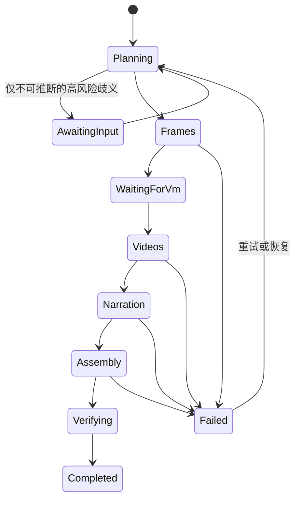

# 一句话出片：持久化生产编排设计

## 结论

现有系统已经具备剧本、分镜、首帧、H3 视频、配音和本地合成工具，但不能可靠地用一次 Agent 请求完成整片。长任务目前依赖浏览器 SSE 请求存活，缺少持久化生产任务、后台执行器、阶段检查点、重试策略和 VM 生命周期协调。

在以下能力完成前，“一句话出片”只应创建生产任务，不应直接在当前对话请求中串行执行全部生成。

## 用户入口

导演只需提交目标和约束，例如：

> 把当前 PulseDeck 产品分镜制作成 608x352 的 H3 粗剪，全片中文旁白；优先使用已有参考图，缺失参考图按文字设定继续，完成后合成为 MP4。

入口将自然语言解析为 `ProductionRunSpec`。未明确的低风险参数使用项目默认值；只有缺少凭据、目标分镜不唯一、素材存在多个无法判定的候选或会覆盖导演已选成片时才阻断。

## 持久化模型

新增 `ProductionRun`：

- `Id`, `ProjectId`, `Status`, `RequestedBy`, `OriginalInstruction`
- `SpecJson`, `CurrentStage`, `LeaseOwner`, `LeaseExpiresAtUtc`
- `CreatedAtUtc`, `StartedAtUtc`, `CompletedAtUtc`, `LastError`
- `VmRequested`, `VmStartedByRun`, `KeepVmRunning`

新增 `ProductionRunItem`，每个 shot 每个阶段一条：

- `RunId`, `ShotResourceId`, `ShotAssetId`, `Stage`, `Status`, `Attempt`
- `InputFingerprint`, `OutputAssetId`, `ErrorCode`, `ErrorDetail`
- `StartedAtUtc`, `CompletedAtUtc`

`InputFingerprint` 由 shot 最新正文、项目配置、选定参考资产和提示词版本计算。指纹未变化且输出仍存在时跳过，保证重试不会重复计费。

## 状态机

阶段规则：

1. `Planning`：锁定最新剧本和结构化分镜，生成 shot 清单，检查唯一镜号、时长、旁白文本和运行配置。
2. `Frames`：查询持久化 `first-frame` 绑定，只处理缺失或输入指纹变化的 shot。保留全部明确的已有参考图；导演在指令中授权“缺失参考按文字继续”时不再逐项询问。
3. `WaitingForVm`：后台任务进入该状态后，由基础设施执行器启动 Azure VM、申请 JIT，并回写结果。项目 Agent 不接触 Azure 凭据。
4. `Videos`：建立 ComfyUI 隧道并检查模型/workflow，逐镜生成和绑定视频；失败按错误类型退避重试，已完成项不重做。
5. `Narration`：逐镜生成旁白并以 `other` 绑定；没有可朗读文本时阻断，不朗读画面说明。
6. `Assembly`：本地 FFmpeg 一次性组装完整成片，要求每镜都有视频和旁白。
7. `Verifying`：校验 MP4 签名、大小、时长、分辨率、FPS、镜头数、音频数以及来源元数据。

## 执行边界

- API 的创建命令只落库并返回 `runId`，不在 HTTP/SSE 生命周期内执行长任务。
- `BackgroundService` 使用数据库 lease 获取任务；API 重启后可继续未完成 run，同一 run 同时只允许一个 worker。
- 图片、H3 和 TTS 按各自工具约束严格串行。不同阶段不并行，先确保可追踪与可恢复。
- VM 只在 `Frames` 全部成功后启动，避免图片阶段阻断时产生 GPU 空转费用。
- 默认仅停止“本 run 启动的 VM”，且必须由 `KeepVmRunning=false` 明确授权；停止动作放在完成或终止后的 finally 补偿任务中。
- 取消只阻止新 item 开始，正在执行的外部调用等待安全结束并记录结果。

## API 与工具

- `POST /api/projects/{projectId}/production-runs`：创建 run。
- `GET /api/projects/{projectId}/production-runs/{runId}`：返回阶段、逐镜进度、成本相关计数和阻断项。
- `POST .../{runId}/resume`：补充导演决定后恢复。
- `POST .../{runId}/cancel`：请求安全取消。
- Agent 新增 `start_full_production` 和 `get_full_production_status` 工具；顶层技能只负责创建/查询 run，不直接在对话请求中逐镜循环调用生成工具。

## 验收标准

- 浏览器关闭和 API 重启后，run 可从最后一个成功 item 继续。
- 相同输入重试不会生成重复首帧、视频或配音版本。
- VM 在首帧全部完成前保持关闭；远程阶段结束后按 run 策略处理 VM。
- 完成态必须有真实 `video/mp4` 资产，且 `shotCount == audioClipCount == 目标镜头数`。
- 任一失败都能定位到 stage、shot、attempt 和外部错误，不以聊天文本作为完成依据。
